# 01 - Ambiente Cloud9

Neste laboratório faremos uso recorrente do serviço Cloud9.

1. Verifique a região no topo à direita do console AWS, normalmente é **Norte da Virgínia**.<br>
**Não** altere essa configuração!
<div align="left">

 

</div>

2. Abra o console da AWS e na caixa de busca superior digite **Cloud9**.
<div align="left">


</div>

3. Clique no link Cloud9
<div align="left">

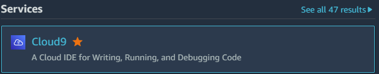

</div>

4. Clique em **Criar ambiente**
<div align="left">

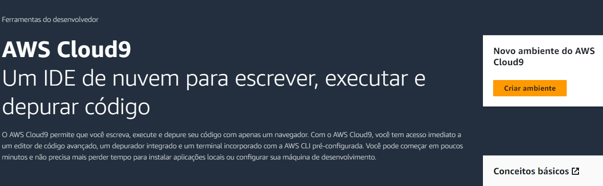

</div>

---
>Outra forma de acesso ao console Cloud9 é via menu "sanduíche" (três barras horizontais) logo abaixo do logo da AWS.
>
>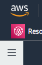
>
>Ao abrir o menu, clique então em **Meus ambientes**
>
> 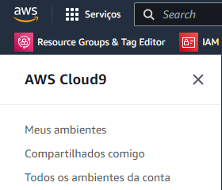
>
>Você será direcionado ao console do Cloud9 onde também está disponível o botão **Criar ambiente**
>
>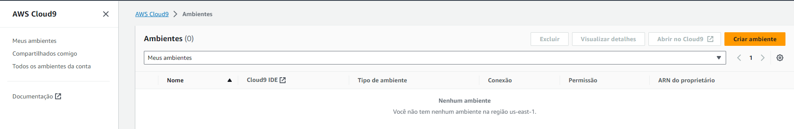
---

5. Será exibida a tela **Criar ambiente** confirme seguir.

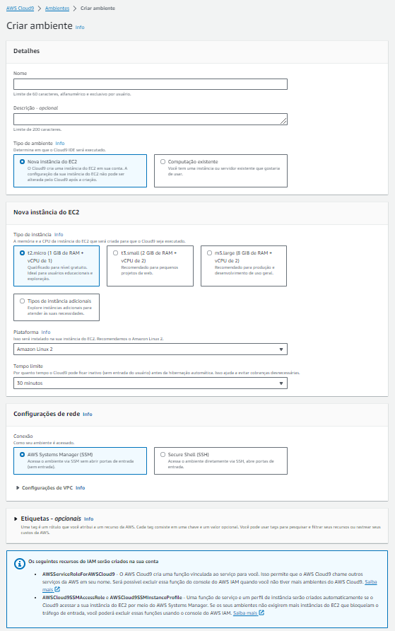

6. Campo **Nome**: informe `lab`.

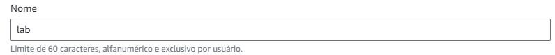

7. Campo **Descrição**: deixe em branco.

8. **Tipo de ambiente**: selecione `Nova instância do EC2`.

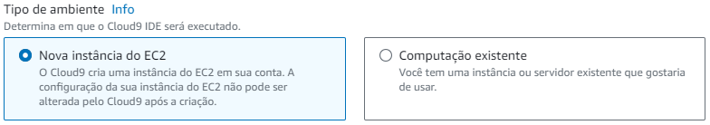

9. **Tipo instância**: selecione `t3.small`

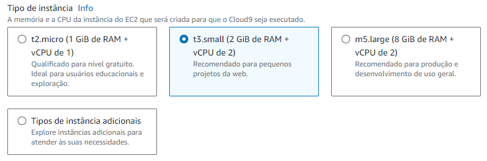

10. **Plataforma**: selecione `Ubuntu Server 22.04 LTS` 

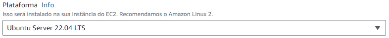

11. **Tempo limite**: selecione `1 hora`

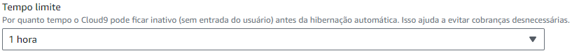

12. **Conexão**: deixe selecionado `Secure Shell (SSH)`

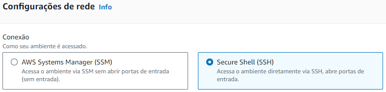

13. Clique em **Criar** ao final da página

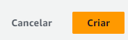

>Leva de 2 a 3 minutos para o ambiente ser criado. 

Ao ser criado, seu ambiente aparece no console do Cloud9
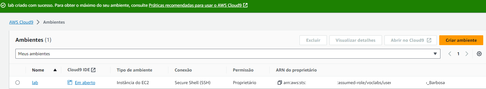

14. Para abrir o IDE do ambiente criado, clique em "Em aberto" conforme a seguir:

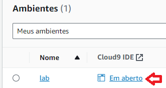

15. Uma nova aba será aberta com o IDE do Cloud9 criado:

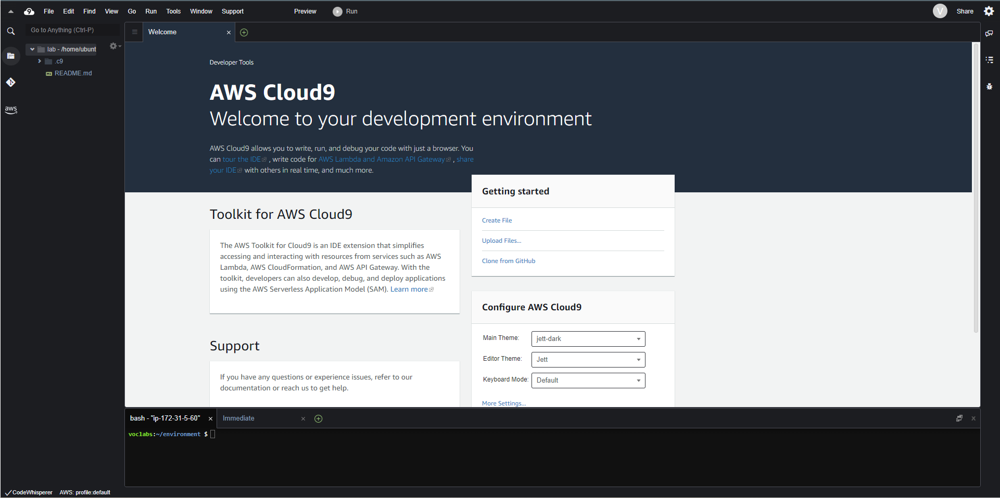

16. Clone do git deste laboratório:

```
git clone https://github.com/infobarbosa/bootcamp_advanced_data_engineering.git
```
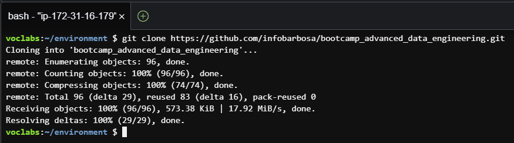


17. Navegue para o diretório ` bootcamp_advanced_data_engineering/scripts/`:

```
cd bootcamp_advanced_data_engineering/scripts/

```
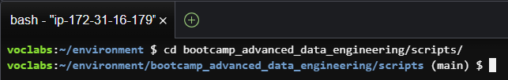

18. Execute o script `lab_setup.sh` conforme a seguir:
```
sh lab_setup.sh
```
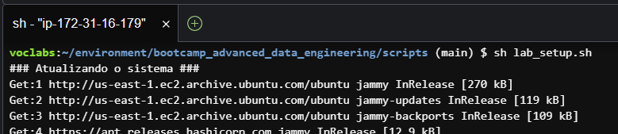

Esse script executa algumas tarefas administrativas importantes para esse laboratório.
- atualização de pacotes
- instalação do jq
- instalação do boto3
- redimensionamento de disco

19. Ao término da execução, é possível conferir o tamanho do disco através do comando `df -h`:

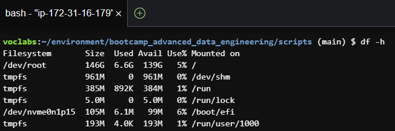

Parabéns! Seu ambiente Cloud9 está pronto pra uso!
