Author: Prof. Barbosa<br>
Contact: infobarbosa@gmail.com<br>
Github: [infobarbosa](https://github.com/infobarbosa)

# 02 - Bucket S3

O objetivo desta sessão é criar o bucket S3 e estrutura de diretórios necessários à execução do laboratório.

### O bucket

1. Digite `s3` na barra de buscas do console AWS 

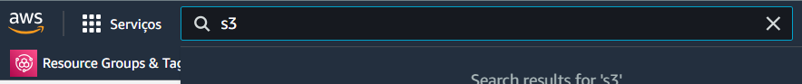

2. Clique em `S3` 

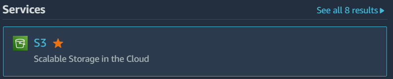

Você será direcionado para a página inicial do S3:

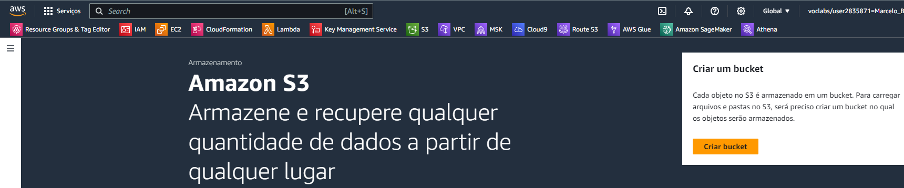

3. Clique em **Criar bucket**<br>
Preencha as informações desta tela conforme a seguir:

4. **Nome do bucket**: `lab-data-eng-[ANOMÊS]-[NUMERO ALEATORIO]`

- Substitua [ANOMÊS] pelo ano e mês correntes no formato AAAAMM. 
- Substitua [NUMERO ALEATÓRIO] por um número aleatório qualquer. 

Exemplo: 
```
lab-data-eng-202311-12345
```
O objetivo do número aleatório é não haver colisão de nomes entre os diversos laboratórios.

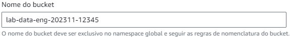

5. Região da AWS<br>
Mantenha inalterado

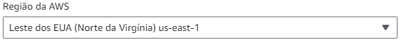

6. **Propriedade de objeto**<br>
Mantenha inalterado

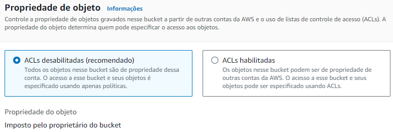

7. **Configurações de bloqueio do acesso público deste bucket**<br>
Mantenha inalterado

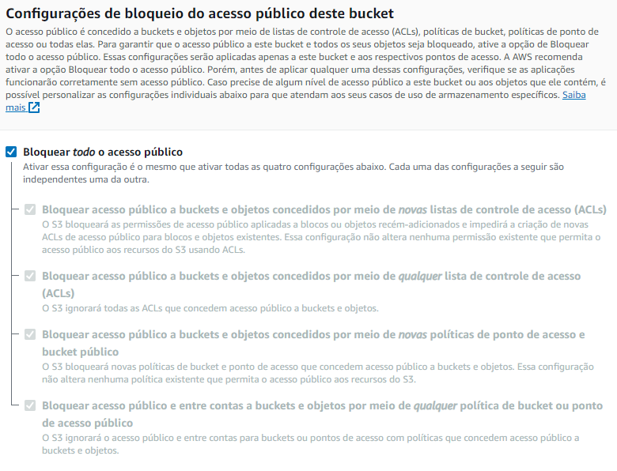

8. **Versionamento de bucket**<br>
Mantenha inalterado

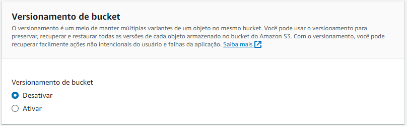

9. **Tags**<br>
Mantenha inalterado

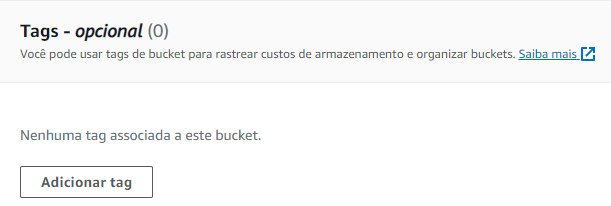

10. **Criptografia padrão**<br>
Mantenha inalterado

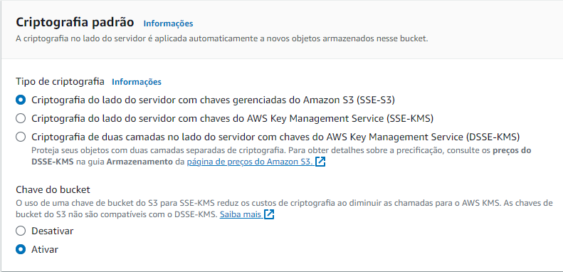

11. Clique em **Criar bucket** ao final da página

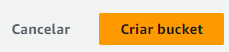

12. Você será direcionado ao painel onde é exibido o conteúdo do bucket criado <br>


## A estrutura de diretórios

Neste laboratório vamos utilizar a estrutura de diretórios recomendada pela AWS [aqui](https://docs.aws.amazon.com/prescriptive-guidance/latest/defining-bucket-names-data-lakes/naming-structure-data-layers.html)

1. Clique em **Criar pasta**<br>

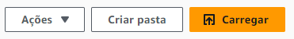

2. Informe `raw` como nome da pasta e deixe os demais campos inalterados. <br>

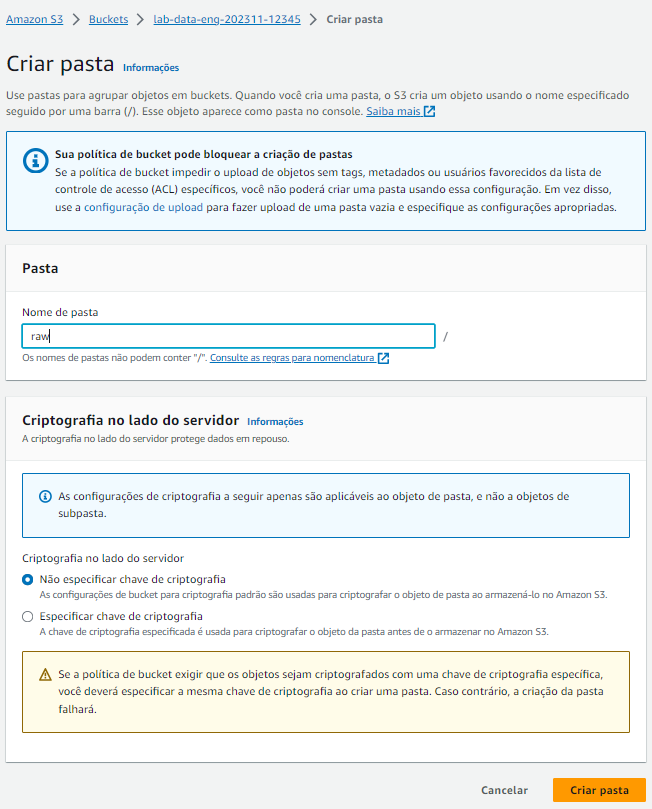

Faça o mesmo para as outras duas pastas: `stage` e `analytics`

Ao final a estrutura de pastas deverá estar assim:

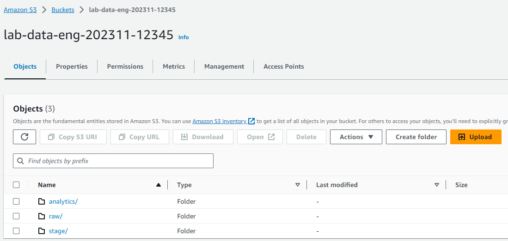


## Bônus - Via terminal Cloud9

#### Variável de ambiente `bucket_name`
```
export bucket_name=lab-data-eng-202312-p4004
```
#### Criando o bucket
```
aws s3api create-bucket --bucket ${bucket_name}
```

Output:
```
voclabs:~/environment/bootcamp-advanced-data-engineering (main) $ aws s3api create-bucket --bucket ${bucket_name}
{
    "Location": "/lab-data-eng-202312-p4004"
}
voclabs:~/environment/bootcamp-advanced-data-engineering (main) $ 
```

#### Criando a estrutura de pastas
```
aws s3api put-object --bucket ${bucket_name} --key raw/
```

Output:
```
voclabs:~/environment/bootcamp-advanced-data-engineering (main) $ aws s3api put-object --bucket ${bucket_name} --key raw/
{
    "ETag": "\"d41d8cd98f00b204e9800998ecf8427e\"",
    "ServerSideEncryption": "AES256"
}
voclabs:~/environment/bootcamp-advanced-data-engineering (main) $
```

Crie a mesma estrutura para as demais pastas:

```
aws s3api put-object --bucket ${bucket_name} --key stage/
```

```
aws s3api put-object --bucket ${bucket_name} --key analytics/
```

```
aws s3api put-object --bucket ${bucket_name} --key scripts/
```
