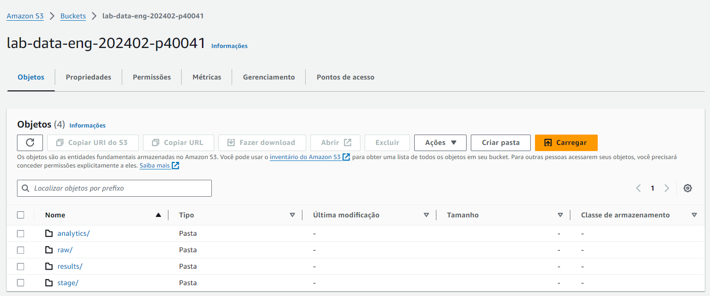

# Bootcamp Advanced Data Engineering
Author: Prof. Barbosa<br>
Contact: infobarbosa@gmail.com<br>
Github: [infobarbosa](https://github.com/infobarbosa)

# 02 - Bucket S3

O objetivo desta sessão é criar o bucket S3 e estrutura de diretórios necessários à execução do laboratório.<br>
A seguir são apresentadas duas opções para criação para criação do bucket: 
- via terminal com AWS CLI;
- via console AWS S3.

Vamos priorizar o uso do **terminal com AWS CLI** neste laboratório.

## Via terminal com AWS CLI

### Passo a passo
#### 1. Crie a variável de ambiente `BUCKET_NAME`

> ### Atenção!
> - Os próximos comandos têm o propósito de criar um bucket com o seguinte formato:<br>
>   `lab-data-eng-[DATA FORMATO YYYYMMDD]-[ID DA CONTA AWS]-[NOME DE USUÁRIO]`
> - Não é necessário compreender imediatamente esses comandos, porém é interessante estudá-los no futuro. 

Obtenção do ID da conta AWS:
```
export AWS_ACCOUNT_ID=`aws sts get-caller-identity --query Account --output text`
``` 

Obtenção do nome do usuário:
```
readarray -d '=' -t strarr <<< `aws sts get-caller-identity --output json | jq '.Arn | split("/")[-1]' -r`
```

```
export AWS_USER_NAME="${strarr[0]}"
```

Criação da variável de ambiente `BUCKET_NAME`
```
export BUCKET_NAME=lab-data-eng-$(date '+%Y%m%d')-${AWS_ACCOUNT_ID}-${AWS_USER_NAME}
```

```
echo ${BUCKET_NAME}
```

#### 2. Crie o bucket
```
aws s3api create-bucket --bucket ${BUCKET_NAME}
```

Output:
```
voclabs:~/environment/bootcamp-advanced-data-engineering (main) $ aws s3api create-bucket --bucket ${BUCKET_NAME}
{
    "Location": "/lab-data-eng-202312-1234567890-barbosa"
}
voclabs:~/environment/bootcamp-advanced-data-engineering (main) $ 
```

#### 3. Verifique se o bucket foi criado corretamente
```
aws s3 ls
```

Output esperado:
```
voclabs:~/environment/bootcamp-advanced-data-engineering (main) $ aws s3 ls
2024-01-27 20:56:32 lab-data-eng-202402-p4004
```

#### 4. Crie a estrutura de pastas

###### Pasta `raw`
```
aws s3api put-object --bucket ${BUCKET_NAME} --key raw/
```

Output:
```
voclabs:~/environment/bootcamp-advanced-data-engineering (main) $ aws s3api put-object --bucket ${BUCKET_NAME} --key raw/
{
    "ETag": "\"d41d8cd98f00b204e9800998ecf8427e\"",
    "ServerSideEncryption": "AES256"
}
voclabs:~/environment/bootcamp-advanced-data-engineering (main) $
```

###### Pasta `ecommerce`

Crie a pasta `ecommerce` dentro da pasta `raw`:
```
aws s3api put-object --bucket ${BUCKET_NAME} --key raw/ecommerce/
```

Crie a mesma estrutura para as demais pastas:

###### Pasta `stage`
```
aws s3api put-object --bucket ${BUCKET_NAME} --key stage/
```

###### Pasta `analytics`
```
aws s3api put-object --bucket ${BUCKET_NAME} --key analytics/
```

###### Pasta `scripts`
```
aws s3api put-object --bucket ${BUCKET_NAME} --key scripts/
```

###### Pasta `results`
```
aws s3api put-object --bucket ${BUCKET_NAME} --key results/
```

Pronto! A estrutura das principais pastas que vamos usar neste laboratório está criada.<br>

###### Conferindo tudo
```
aws s3 ls ${BUCKET_NAME}
```

---

## [OPCIONAL] Via console AWS S3

> ### Atenção!
> Se você utilizou a opção **via terminal AWS CLI** então não é necessário executar esta sessão.<br>
> Esta sessão é opcional e apresenta a criação do bucket via console (página) do AWS S3.

### Passo a passo
1. Digite `s3` na barra de buscas do console AWS;


2. Clique em `S3` 


Você será direcionado para a página inicial do S3:


3. Clique em **Criar bucket**<br>
Preencha as informações desta tela conforme a seguir:

4. **Nome do bucket**: `lab-data-eng-[ANOMÊS]-[NUMERO ALEATORIO]`
    > **Atenção!**<br>
    > O nome do bucket sugerido é de extrema importância para a execução deste laboratório.

- Substitua [ANOMÊS] pelo ano e mês correntes no formato AAAAMM. 
- Substitua [NUMERO ALEATÓRIO] por um número aleatório qualquer. 

Exemplo: 
```
lab-data-eng-202402-12345
```
O objetivo do número aleatório é não haver colisão de nomes entre os diversos laboratórios.


5. Região da AWS<br>
Mantenha inalterado


6. **Propriedade de objeto**<br>
Mantenha inalterado


7. **Configurações de bloqueio do acesso público deste bucket**<br>
Mantenha inalterado


8. **Versionamento de bucket**<br>
Mantenha inalterado


9. **Tags**<br>
Mantenha inalterado


10. **Criptografia padrão**<br>
Mantenha inalterado


11. Clique em **Criar bucket** ao final da página


Será exibida a tela **Amazon S3 >
Buckets** com a lista de buckets e uma tarja verde superior.<br>


12. Clique no botão **View details** na tarja verde superior.<br>

Você será direcionado ao painel onde é exibido o conteúdo do bucket criado <br>


> Você também poderia clicar no link do bucket criado para acessar a mesma pasta.

## A estrutura de diretórios

Neste laboratório vamos utilizar a estrutura de diretórios recomendada pela AWS [aqui](https://docs.aws.amazon.com/prescriptive-guidance/latest/defining-bucket-names-data-lakes/naming-structure-data-layers.html)

1. Clique em **Criar pasta**<br>


2. Em **Nome da pasta** informe `raw`, deixe os demais campos inalterados. <br>


3. Clique no botão **Criar pasta**;

4. Repita o procedimento acima para criar as pastas: `stage`, `analytics` e `results`;

Ao final a estrutura de pastas deverá estar assim:



5. Crie a pasta `ecommerce` dentro da pasta `raw`.


