Author: Prof. Barbosa<br>
Contact: infobarbosa@gmail.com<br>
Github: [infobarbosa](https://github.com/infobarbosa)

# 02 - Bases de dados

O objetivo desta sessão é obter os datasets (bases de dados) necessários à execução do laboratório.

### Atenção!
O professor disponibilizará um ou mais links (mais especificamente URLs pré-assinadas) para download dos datasets.

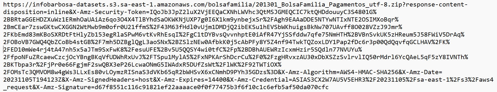

## Bucket S3
Vamos criar o bucket e estrutura de para onde vamos fazer o upload dos arquivos.

1. Digite `s3` na barra de buscas do console AWS 

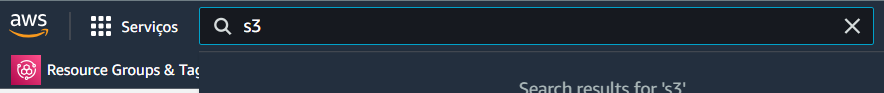

2. Clique em `S3` 

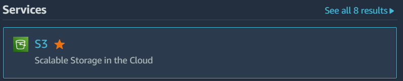

Você será direcionado para a página inicial do S3:

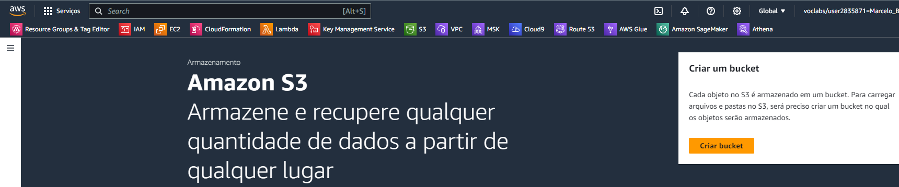

3. Clique em **Criar bucket**<br>
Preencha as informações desta tela conforme a seguir:

4. **Nome do bucket**: `lab-data-eng-[ANOMÊS]-[NUMERO ALEATORIO]`

- Substitua [ANOMÊS] pelo ano e mês correntes no formato AAAAMM. 
- Substitua [NUMERO ALEATÓRIO] por um número aleatório qualquer. 

Exemplo: 
```
lab-data-eng-202311-12345
```
O objetivo do número aleatório é não haver colisão de nomes entre os diversos laboratórios.

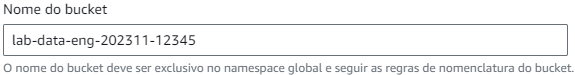

5. Região da AWS<br>
Mantenha inalterado

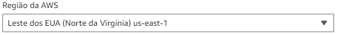

6. **Propriedade de objeto**<br>
Mantenha inalterado

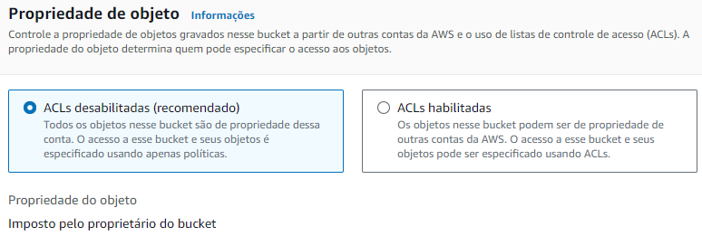

7. **Configurações de bloqueio do acesso público deste bucket**<br>
Mantenha inalterado

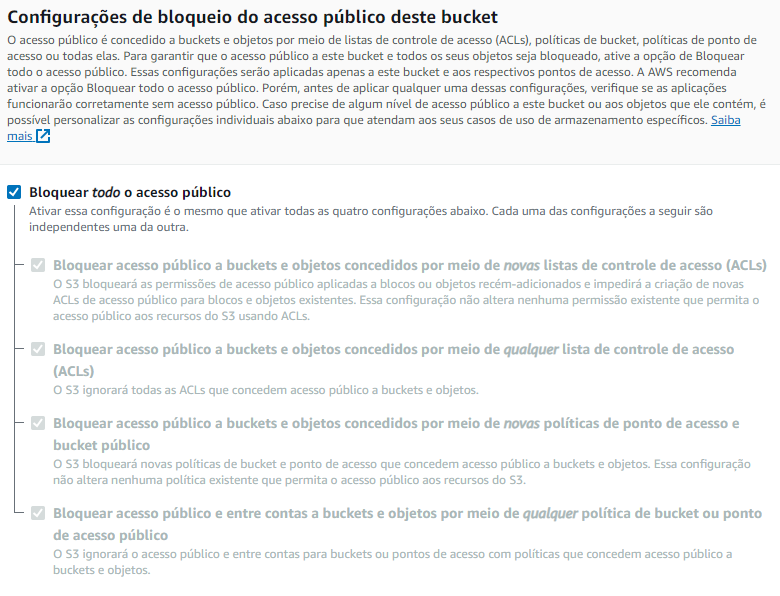

8. **Versionamento de bucket**<br>
Mantenha inalterado

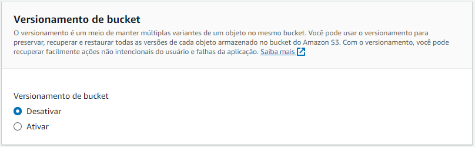

9. **Tags**<br>
Mantenha inalterado

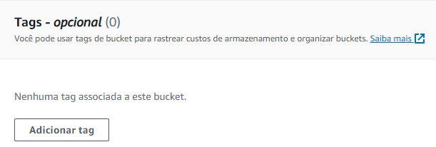

10. **Criptografia padrão**<br>
Mantenha inalterado

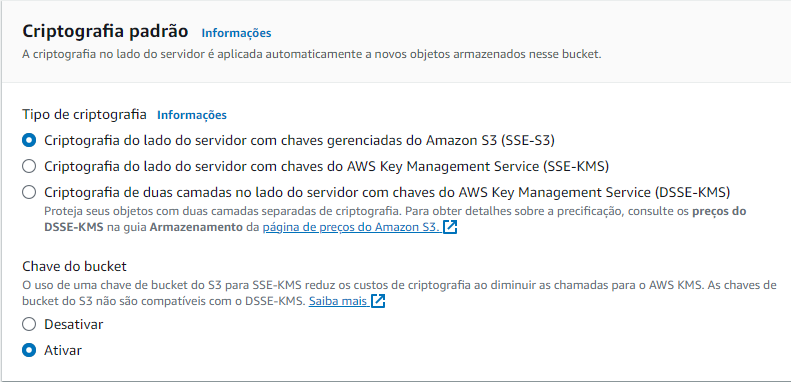

11. Clique em **Criar bucket** ao final da página

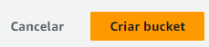

12. Você será direcionado ao painel onde é exibido o conteúdo do bucket criado <br>

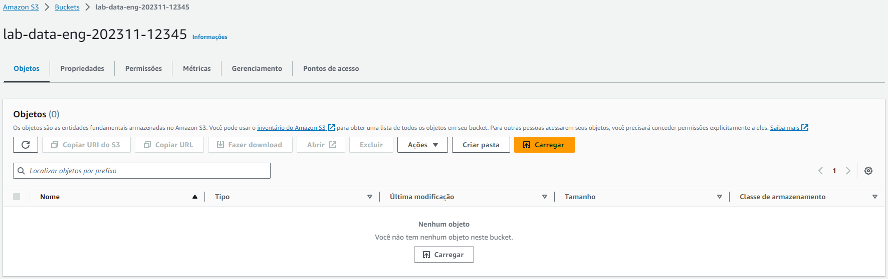

13. Clique em **Criar pasta**<br>

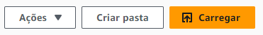

14. Informe `raw` como nome da pasta e deixe os demais campos inalterados. <br>


## Baixando bases para o Cloud9

1. Crie um diretório `data` embaixo do diretório raiz `/home/ubuntu`
```
mkdir -p /home/ubuntu/data
```

2. Navegue para o diretório criado

```
cd /home/ubuntu/data
```
### 1o dataset 
3. Crie uma variável de ambiente `PRESIGNED_URL_1` com a primeira URL pré-assinada disponibilizada pelo professor.


Atenção! Perceba que a URL pré-assinada precisa estar entre aspas duplas.

4. Execute o comando `curl` para download do primeiro dataset:

```
curl -o "201301_BolsaFamilia_Pagamentos_utf-8.zip" ${PRESIGNED_URL_1}
```

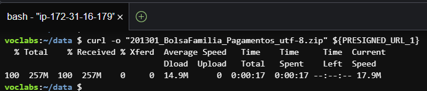

Atenção! O nome do arquivo na sintaxe do `curl` precisa corresponder ao arquivo da URL pré-assinada e também estar entre aspas duplas.

### 2o dataset
Execute o mesmo procedimento para download do segundo dataset:

5. Crie uma variável de ambiente `PRESIGNED_URL_2` com a segunda URL pré-assinada disponibilizada pelo professor. 


```
curl -o "202303_NovoBolsaFamilia_utf-8.zip" ${PRESIGNED_URL_2}
```
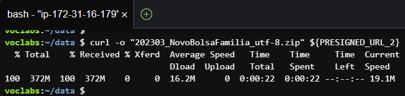

6. Após os dois downloads, seu diretório estará assim: 

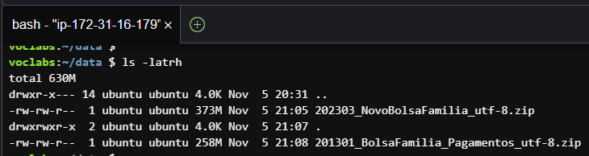


