Author: Prof. Barbosa<br>
Contact: infobarbosa@gmail.com<br>
Github: [infobarbosa](https://github.com/infobarbosa)

# 03 - Bases de dados

O objetivo desta sessão é obter os datasets (bases de dados) necessários à execução do laboratório.

### Atenção!
> O professor disponibilizará um ou mais links (mais especificamente URLs pré-assinadas) para download dos datasets.

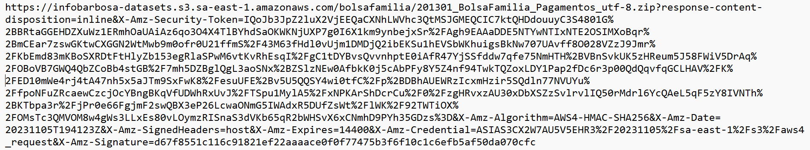

Há dois métodos descritos nessa sessão: via console AWS S3 (mais simples) e via terminal AWS Cloud9.

## Método 1 - Console AWS S3
Neste método você deve fazer o download das bases de dados via navegador para a sua máquina e então fazer o upload das bases para o diretório especificado pelo professor.

1. Para cada link disponibilizado pelo professor, copie e cole na barra de endereços em uma nova aba do seu navegador. O download será iniciado automaticamente, aguarde o término.

2. Acesse o console AWS S3

3. Navegue para o bucket criado no passo 2 `02-Bucket-S3`

4. Navegue para a pasta `raw`

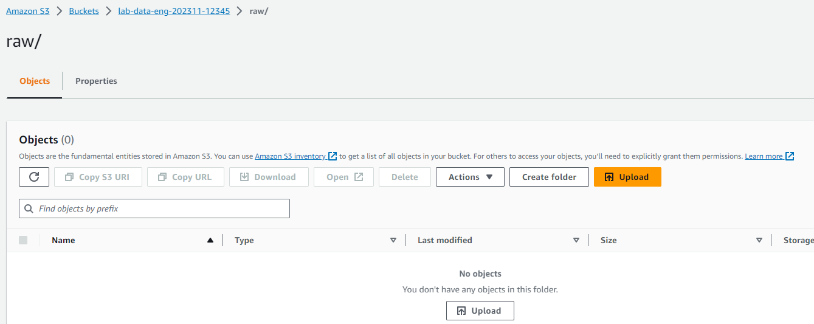

5. Clique no botão Upload

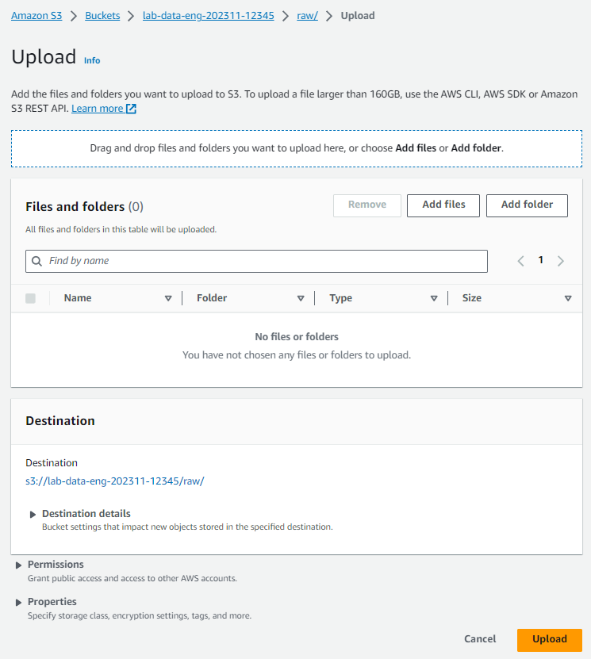

6. Escolha o arquivo a ser carregado
> A escolha do arquivo pode ser via botão `Add files` ou apenas arrastando o arquivo para a página atual.

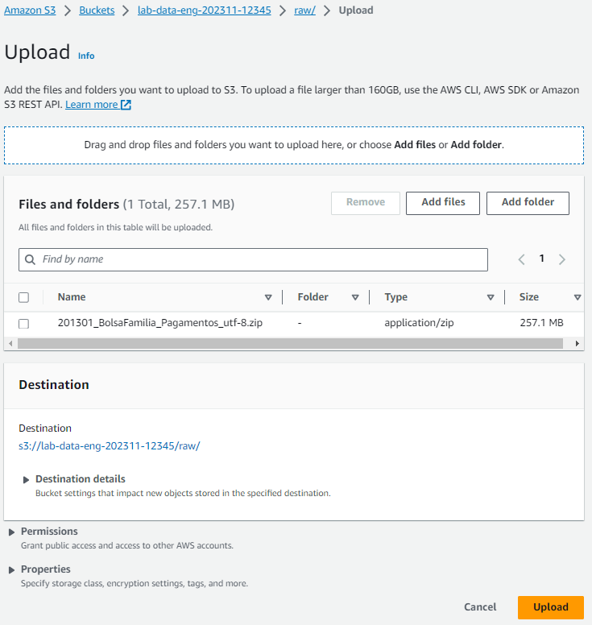

> Você pode escolher mais arquivos para executar um único upload.

7. Clique em `Upload` ao final da página.

8. Aguarde o término do upload

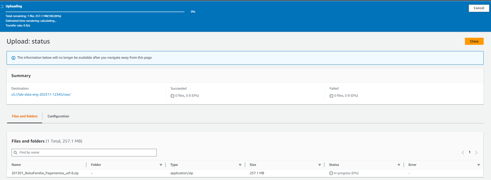

9. Verifique o status de upload `Succeeded`
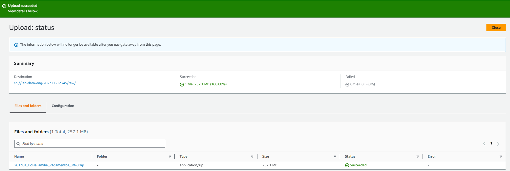

10. Clique no botão  

> O botão encontra-se no topo da tela à direita.

11. Repita a operação para os demais arquivos

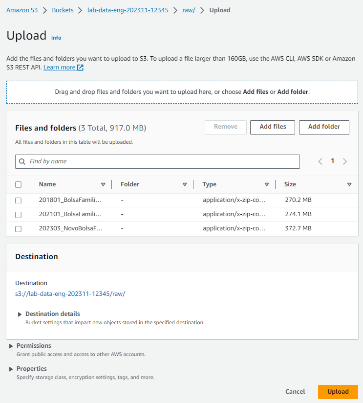

12. Clique em `Upload` ao final da página

13. Ao final do upload, clique no botão `Close` para fechar a página de upload.

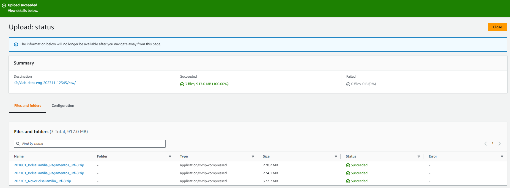

## Método 2 - Terminal Cloud9

## Baixando bases para o Cloud9

1. Crie um diretório `data` embaixo do diretório raiz `/home/ubuntu`
```
mkdir -p /home/ubuntu/data
```

2. Navegue para o diretório criado

```
cd /home/ubuntu/data
```
### 1o dataset 
3. Crie uma variável de ambiente `PRESIGNED_URL_1` com a primeira URL pré-assinada disponibilizada pelo professor.

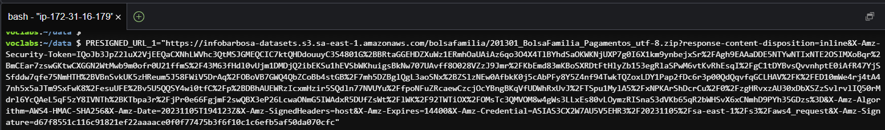
Atenção! Perceba que a URL pré-assinada precisa estar entre aspas duplas.

4. Execute o comando `curl` para download do primeiro dataset:

```
curl -o "201301_BolsaFamilia_Pagamentos_utf-8.zip" ${PRESIGNED_URL_1}
```


Atenção! O nome do arquivo na sintaxe do `curl` precisa corresponder ao arquivo da URL pré-assinada e também estar entre aspas duplas.

### 2o dataset
Execute o mesmo procedimento para download do segundo dataset:

5. Crie uma variável de ambiente `PRESIGNED_URL_2` com a segunda URL pré-assinada disponibilizada pelo professor. 

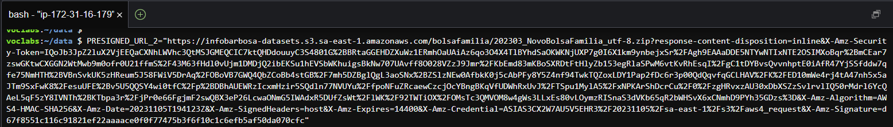
```
curl -o "202303_NovoBolsaFamilia_utf-8.zip" ${PRESIGNED_URL_2}
```


6. Após os dois downloads, seu diretório estará assim: 

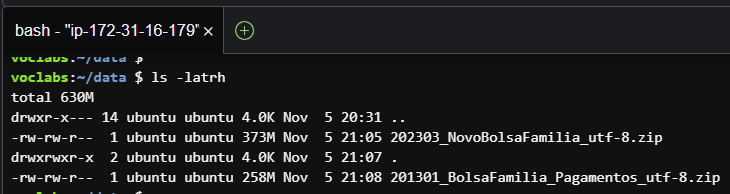


