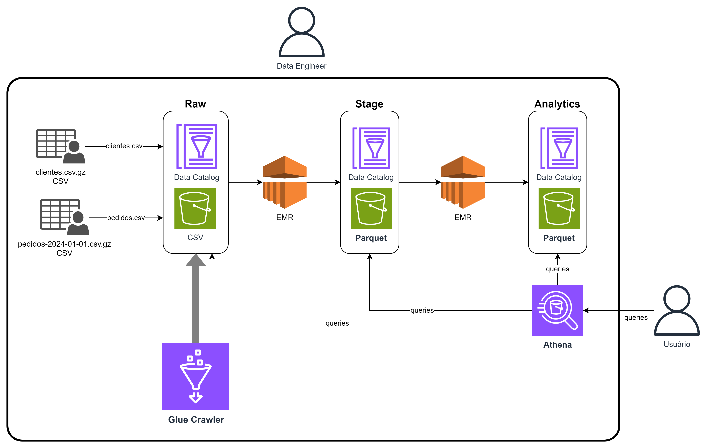

# Bootcamp Advanced Data Engineering
Author: Prof. Barbosa<br>
Contact: infobarbosa@gmail.com<br>
Github: [infobarbosa](https://github.com/infobarbosa)

# EMR
O objetivo deste exercício é ativar um cluster EMR e executar algumas operações em lote (batch) sobre o mesmo.



> ## Atenção!
> ### Custo
> Parte dos recursos alocados para o cluster EMR continuam sendo cobrados mesmo que desligados.<br>
> Portanto, recomenda-se **eliminar** o cluster e realocá-lo novamente entre as suas sessões de estudo.
>
> ### Chaves criptográficas
> Este exercício faz uso de uma chave criptográfica (key pair) para acesso SSH. <br>
> Caso esteja utilizando o **AWS Academy**, a key pair `vockey` escolhida é disponibilizada na página do **Vocaerum**.<br>
> Clique em **AWS Details** e na sequência em **Download PEM**.<br> 
> Arraste então o arquivo `labsuser.pem` da sua máquina para a pasta do projeto no **AWS Cloud9**.<br>
> Execute o comando:
>```
>   chmod 600 labsuser.pem 
>```
> Liste o arquivo para checar as permissões:
>```
>   ls -la
>```
>
> Output esperado:
>```
>   voclabs:~/environment/bootcamp-advanced-data-engineering (main) $ ls -la labsuser.pem
>   -rw------- 1 ubuntu ubuntu 1678 Jan 20 13:09 labsuser.pem 
>```

## Parte 1 - Criação do cluster

### Via Console AWS 
1. Na barra de busca digite **EMR**, clique no link disponibilizado;
2. Na tela principal do EMR, clique em **Create cluster**;
3. No campo **Name** digite `dataeng-lab`;
4. Em **Amazon EMR release**, selecione **emr-6.15.0**;
5. Em **Application bundle**, selecione **Spark Interactive**;
6. Abaixo é exibida uma lista de componentes. Mantenha inalterado;
7. Em **AWS Glue Data Catalog settings**:
    - marque **Use for Hive table metadata**;
    - marque **Use for Spark table metadata**.
8. Na sessão **Cluster configuration**, selecione **Uniform instance groups**;
9. Na sessão **Instance groups section** selecione **m4.large** para **Primary**, **Core** e **Task 1 of 1**;
10. Role a tela até a sessão **Networking**;
11. Em **Virtual private (VPC)**, verifique a VPC pré-selecionada, mas mantenha inalterado;
12. Em **Subnet**, verifique a subnet pré-selecionada, mas mantenha inalterada;
13. Role a tela até a sessão **Cluster termination**;
14. Em **Cluster termination**, selecione **Manually terminate cluster**;
15. Role a tela até a sessão **Security configuration and EC2 key pair**;
16. Em **Security configuration**, deixe em branco;
17. Em **Amazon EC2 key pair for SSH to the cluster**, escolha **vockey**;
18. Role a tela até a sessão **Identity and Access Management (IAM) roles**;
19. Em **Amazon EMR service role**, selecione **Choose an existing service role**;
20. Em **Service role**, selecione **EMR_DefaultRole**;
21. Em **EC2 instance profile for Amazon EMR**, escolha **Choose an existing instance profile**;
22. Em **Instance profile**, selecione **EMR_EC2_DefaultRole**;
23. Clique em **Create cluster**;

A criação e ativação do cluster leva em torno de 10 minutos.

> Importante! No passo 7 indicamos que queremos usar o Glue Catalog como metastore do EMR.<br>
> Você pode estudar mais sobre isso [aqui](https://docs.aws.amazon.com/emr/latest/ReleaseGuide/emr-spark-glue.html).

---

# Parte 2 - Regra de firewall para acesso ao cluster

Esta sessão tem por objetivo conectar no cluster que acabamos de criar e então executar alguns comandos utilizando Spark shell.

## Preparação
24. Variável de ambiente `BUCKET_NAME`
```
export BUCKET_NAME=$(aws s3api list-buckets --query "Buckets[].Name" | grep 'lab-data-eng' | tr -d ' ' | tr -d '"' | tr -d ',')

echo $BUCKET_NAME
```

> Regra de firewall Cloud9->EMR
> Será necessário adicionar uma regra ao security group para permitir o acesso via porta ssh (porta 22).<br>

> #### Via terminal **Cloud9**
25. Variável de ambiente `EMR_MASTER_SG`
Vamos criar uma variáve com o ID do security group do node master do EMR
```
export EMR_MASTER_SG=$(aws ec2 describe-security-groups \
    --filter Name=group-name,Values=ElasticMapReduce-master \
    --query 'SecurityGroups[*].[GroupId]' --output text)
```

26. Variável de ambiente `EC2_PUBLIC_IP`

O IP público da instância EC2 do Cloud9
```
export EC2_PUBLIC_IP=$(curl http://169.254.169.254/latest/meta-data/public-ipv4)

echo $EC2_PUBLIC_IP
```

27. Variável de ambiente `EC2_PRIVATE_IP`

O IP privado da instância EC2 do Cloud9
```
export EC2_PRIVATE_IP=$(curl http://169.254.169.254/latest/meta-data/local-ipv4)

echo $EC2_PRIVATE_IP
```

28. Adição da regra de firewall ao security group

```
aws ec2 authorize-security-group-ingress \
    --group-id ${EMR_MASTER_SG} \
    --protocol tcp \
    --port 22 \
    --cidr "${EC2_PUBLIC_IP}/32"
```

```
aws ec2 authorize-security-group-ingress \
    --group-id ${EMR_MASTER_SG} \
    --protocol tcp \
    --port 22 \
    --cidr "${EC2_PRIVATE_IP}/20"
```

> ## Atenção!
>Caso os comandos acima não funcionem, você pode abrir a regra para a Internet.<br>
>**Importante**! Nunca use esse método em produção!
>```
>aws ec2 authorize-security-group-ingress \
>   --group-id ${EMR_MASTER_SG} \
>   --protocol tcp \
>   --port 22 \
>   --cidr "0.0.0.0/0"
>```


## Parte 3 - Acesso ao cluster
> No terminal (shell) do **Cloud9**;

Vamos criar duas pastas no bucket do S3 que usaremos ao final deste laboratório.

29. Pasta `output/pedidos/`
```
aws s3api put-object --bucket ${BUCKET_NAME} --key output/pedidos/
```

30. Pasta `output/top10/`
```
aws s3api put-object --bucket ${BUCKET_NAME} --key output/top10/
```

Agora obtenha o ID do cluster EMR via terminal **Cloud9**

31. O ID do cluster EMR
```
export CLUSTER_ID=$(aws emr list-clusters | jq '.Clusters[0].Id' | tr -d '"')
```

```
echo ${CLUSTER_ID}
```

Use `CLUSTER_ID` para obter o **DNS público** do cluster

32. O DNS público do cluster
```
export MASTER_HOST=$(aws emr describe-cluster --cluster-id $CLUSTER_ID | jq '.Cluster.MasterPublicDnsName' | tr -d '"')
```

```
echo $MASTER_HOST
```

33. Conecte-se ao cluster via SSH
```
ssh -i ./labsuser.pem hadoop@$MASTER_HOST
```

> Caso apresentado um prompt de confirmação, responda `yes` e digite **ENTER**.

Output esperado:
```
voclabs:~/environment/bootcamp-advanced-data-engineering (main) $ ssh -i ./labsuser.pem hadoop@$MASTER_HOST
Last login: Sat Jan 20 13:55:03 2024
   ,     #_
   ~\_  ####_        Amazon Linux 2
  ~~  \_#####\
  ~~     \###|       AL2 End of Life is 2025-06-30.
  ~~       \#/ ___
   ~~       V~' '->
    ~~~         /    A newer version of Amazon Linux is available!
      ~~._.   _/
         _/ _/       Amazon Linux 2023, GA and supported until 2028-03-15.
       _/m/'           https://aws.amazon.com/linux/amazon-linux-2023/

                                                                    
EEEEEEEEEEEEEEEEEEEE MMMMMMMM           MMMMMMMM RRRRRRRRRRRRRRR    
E::::::::::::::::::E M:::::::M         M:::::::M R::::::::::::::R   
EE:::::EEEEEEEEE:::E M::::::::M       M::::::::M R:::::RRRRRR:::::R 
  E::::E       EEEEE M:::::::::M     M:::::::::M RR::::R      R::::R
  E::::E             M::::::M:::M   M:::M::::::M   R:::R      R::::R
  E:::::EEEEEEEEEE   M:::::M M:::M M:::M M:::::M   R:::RRRRRR:::::R 
  E::::::::::::::E   M:::::M  M:::M:::M  M:::::M   R:::::::::::RR   
  E:::::EEEEEEEEEE   M:::::M   M:::::M   M:::::M   R:::RRRRRR::::R  
  E::::E             M:::::M    M:::M    M:::::M   R:::R      R::::R
  E::::E       EEEEE M:::::M     MMM     M:::::M   R:::R      R::::R
EE:::::EEEEEEEE::::E M:::::M             M:::::M   R:::R      R::::R
E::::::::::::::::::E M:::::M             M:::::M RR::::R      R::::R
EEEEEEEEEEEEEEEEEEEE MMMMMMM             MMMMMMM RRRRRRR      RRRRRR
                                                                    
[hadoop@ip-172-31-81-171 ~]$ 

```

## Parte 4 - Utilizando o PySpark

34. Vamos criar a variável de ambiente `BUCKET_NAME`

> Perceba que está criando essa variável no host master do EMR.

```
export BUCKET_NAME=$(aws s3api list-buckets --query "Buckets[].Name" | grep 'lab-data-eng' | tr -d ' ' | tr -d '"' | tr -d ',')
```

```
echo $BUCKET_NAME
```

35. Abra o spark-shell
```
pyspark
```

> A ativação do spark-shell leva de 1 a 2 minutos.

Output esperado:
```
[hadoop@ip-172-31-93-227 ~]$ pyspark
Python 3.7.16 (default, Aug 30 2023, 20:37:53) 
[GCC 7.3.1 20180712 (Red Hat 7.3.1-15)] on linux
Type "help", "copyright", "credits" or "license" for more information.
Setting default log level to "WARN".
To adjust logging level use sc.setLogLevel(newLevel). For SparkR, use setLogLevel(newLevel).
24/01/25 21:30:41 WARN HiveConf: HiveConf of name hive.server2.thrift.url does not exist
24/01/25 21:30:45 WARN Client: Neither spark.yarn.jars nor spark.yarn.archive is set, falling back to uploading libraries under SPARK_HOME.
Welcome to
      ____              __
     / __/__  ___ _____/ /__
    _\ \/ _ \/ _ `/ __/  '_/
   /__ / .__/\_,_/_/ /_/\_\   version 3.4.1-amzn-2
      /_/

Using Python version 3.7.16 (default, Aug 30 2023 20:37:53)
Spark context Web UI available at http://ip-172-31-93-227.ec2.internal:4040
Spark context available as 'sc' (master = yarn, app id = application_1706217953761_0001).
SparkSession available as 'spark'.
>>>
```

Agora que estamos no shell do PySpark podemos criar e manusear dados através de **dataframes**

36. Importação de bibliotecas
```
import os
import sys
from datetime import datetime
from pyspark.sql import SparkSession
from pyspark.sql.functions import *

BUCKET_NAME = os.environ['BUCKET_NAME'] 
```

37. Criação da sessão Spark
```
spark = SparkSession \
    .builder \
    .appName("data-eng-lab") \
    .getOrCreate()
```

Output esperado:
```
>>> spark = SparkSession \
...     .builder \
...     .appName("data-eng-lab") \
...     .getOrCreate()
24/01/25 21:58:31 WARN SparkSession: Using an existing Spark session; only runtime SQL configurations will take effect.
```

38. Definindo o database do Glue Catalog
```
spark.catalog.setCurrentDatabase("ecommerce")
```

Output esperado:
```
>>> spark.catalog.setCurrentDatabase("ecommerce")
24/01/25 22:01:48 INFO HiveConf: Found configuration file file:/etc/spark/conf.dist/hive-site.xml
24/01/25 22:01:48 WARN HiveConf: HiveConf of name hive.server2.thrift.url does not exist
24/01/25 22:01:49 INFO AWSGlueClientFactory: Using region from ec2 metadata : us-east-1
24/01/25 22:01:50 WARN CredentialsLegacyConfigLocationProvider: Found the legacy config profiles file at [/home/hadoop/.aws/config]. Please move it to the latest default location [~/.aws/credentials].
```

39. Dataframe `clientes_parquet`
```
dfCli = spark.sql("select * from ecommerce.clientes_parquet")
```

```
dfCli.show(5)
```

Output esperado:
```
>>> dfCli.show(5)
+---+--------------------+----------+--------------+--------------------+       
| id|                nome| data_nasc|           cpf|               email|
+---+--------------------+----------+--------------+--------------------+
|  9|        Alícia Souza|1960-08-26|784.563.029-29|alicia.souza@exam...|
| 29|Maria Luiza Nogueira|1963-01-29|580.769.423-65|maria.luiza.nogue...|
| 49|   Maria Luiza Lopes|1957-08-17|592.134.068-51|maria.luiza.lopes...|
| 69|         Yago Campos|1944-03-17|342.617.850-80|yago.campos@examp...|
| 89|       Milena Mendes|1975-01-22|389.541.720-32|milena.mendes@exa...|
+---+--------------------+----------+--------------+--------------------+
only showing top 5 rows

```

```
dfCli.printSchema()
```

Output esperado:
```
>>> dfCli.printSchema()
root
 |-- id: integer (nullable = true)
 |-- nome: string (nullable = true)
 |-- data_nasc: string (nullable = true)
 |-- cpf: string (nullable = true)
 |-- email: string (nullable = true)

>>> 
```

40. Dataframe `pedidos_parquet`
```
dfPed = spark.sql("select * from ecommerce.pedidos_parquet")
```

```
dfPed.show(5)
```
Output esperado:
```
>>> dfPed.show(5)
+--------------------+---------+--------------+----------+-------------------+---+----------+-----------+
|           id_pedido|  produto|valor_unitario|quantidade|       data_criacao| uf|id_cliente|data_pedido|
+--------------------+---------+--------------+----------+-------------------+---+----------+-----------+
|a3476cd9-b8b6-4fa...|   TABLET|          1100|         2|2024-01-01T07:00:58| TO|     13417| 2024-01-01|
|d2729a43-68a7-41c...|GELADEIRA|          2000|         3|2024-01-01T04:46:53| SE|     12762| 2024-01-01|
|e96a5477-cf3f-4e0...| SOUNDBAR|           900|         3|2024-01-01T05:57:58| AP|      6716| 2024-01-01|
|2a5bf8db-0695-4ed...|       TV|          2500|         3|2024-01-01T09:25:07| PI|     13112| 2024-01-01|
|b47080eb-675f-44a...|   TABLET|          1100|         2|2024-01-01T20:10:45| PR|      9190| 2024-01-01|
+--------------------+---------+--------------+----------+-------------------+---+----------+-----------+
only showing top 5 rows
``` 

```
dfPed.printSchema()
```

Output esperado:
```
>>> dfPed.printSchema()
root
 |-- id_pedido: string (nullable = true)
 |-- produto: string (nullable = true)
 |-- valor_unitario: float (nullable = true)
 |-- quantidade: long (nullable = true)
 |-- data_criacao: string (nullable = true)
 |-- uf: string (nullable = true)
 |-- id_cliente: long (nullable = true)
 |-- data_pedido: string (nullable = true)

```

41. Calculando os top 10 clientes
```
dfTop10 = spark.sql(
 """SELECT cli.nome, cli.email, sum(ped.quantidade * ped.valor_unitario) total
    FROM clientes_parquet cli
    INNER JOIN pedidos_parquet ped on ped.id_cliente = cli.id
    WHERE ped.data_pedido = '2024-01-01'
    GROUP BY cli.nome, cli.email
    ORDER BY sum(ped.quantidade * ped.valor_unitario) DESC
    LIMIT 10""")
```

```
dfTop10.show(10)
```

Output esperado:
```
>>> dfTop10.show(10)
+-----------------+--------------------+-----+                                  
|             nome|               email|total|
+-----------------+--------------------+-----+
|     Marina Silva|marina.silva@exam...|11700|
|Leandro das Neves|leandro.das.neves...| 9500|
|    Clarice Porto|clarice.porto@exa...| 9500|
|       Levi Souza|levi.souza@exampl...| 8700|
|Ana Lívia Ribeiro|ana.livia.ribeiro...| 8500|
| Gabrielly Aragão|gabrielly.aragao@...| 7800|
|   Caroline Pinto|caroline.pinto@ex...| 7500|
|   Bruno Nogueira|bruno.nogueira@ex...| 7500|
|   Joaquim Vieira|joaquim.vieira@ex...| 7500|
|     Júlia Fogaça|julia.fogaca@exam...| 7500|
+-----------------+--------------------+-----+
```

42. Exportando os resultados
```
dfPed.write.format("json").mode("overwrite").save("s3://"+ BUCKET_NAME +"/output/pedidos/")
```

```
dfTop10.write.format("json").mode("overwrite").save("s3://"+ BUCKET_NAME +"/output/top10/")
```

Verifique os arquivos no bucket.

43. Para sair do pyspark digite:
```
quit()
```

## Parte 5 - Execução de scripts
Uma doc completa pode ser encontrada [aqui](https://docs.aws.amazon.com/emr/latest/ReleaseGuide/emr-commandrunner.html#emr-commandrunner-other-uses).

45. Instale a biblioteca **boto3** no master node
```
pip install boto3
```

46. Digite `Control+D` para sair do master node.
> Atenção! Digite apenas uma vez.

46. Faça o upload do script 

Examine com atenção o script `ecommerce.py` disponível no diretório `11-EMR-Cluster/assets/scripts/ecommerce.py`. Então faça o upload com o comando a seguir.
```
aws s3 cp 11-EMR-Cluster/assets/scripts/ecommerce.py s3://${BUCKET_NAME}/scripts/
```

```
aws s3 ls s3://${BUCKET_NAME}/scripts/ecommerce.py
```

Output experado:
```
voclabs:~/environment/bootcamp-advanced-data-engineering (main) $ aws s3 ls s3://${BUCKET_NAME}/scripts/ecommerce.py
2024-02-23 22:37:39       1684 ecommerce.py
voclabs:~/environment/bootcamp-advanced-data-engineering (main) $ 
```


47. Obtenha o ID do cluster EMR via terminal **Cloud9**
```
export CLUSTER_ID=$(aws emr list-clusters | jq '.Clusters[0].Id' | tr -d '"')
```

```
echo ${CLUSTER_ID}
```

48. Adicione um step do EMR
```
aws emr add-steps \
--cluster-id ${CLUSTER_ID} \
--steps Type=CUSTOM_JAR,Name="ecommerce command-runner.jar",ActionOnFailure=CONTINUE,Jar=command-runner.jar,Args=[spark-submit,s3://${BUCKET_NAME}/scripts/ecommerce.py]
```

Output esperado:
```
voclabs:~/environment/bootcamp-advanced-data-engineering (main) $ aws emr add-steps \
> --cluster-id ${CLUSTER_ID} \
> --steps Type=CUSTOM_JAR,Name="ecommerce command-runner.jar",ActionOnFailure=CONTINUE,Jar=command-runner.jar,Args=[spark-submit,s3://${BUCKET_NAME}/scripts/ecommerce.py]
{
    "StepIds": [
        "s-04665653O07ZKL7818JO"
    ]
}
```

49. Verifique o status do EMR Step
> Altere o id do step para o output do comando anterior
```
aws emr describe-step --cluster-id ${CLUSTER_ID} --step-id s-04665653O07ZKL7818JO
```

Output esperado:
```
voclabs:~/environment/bootcamp-advanced-data-engineering (main) $ aws emr describe-step --cluster-id ${CLUSTER_ID} --step-id s-04665653O07ZKL7818JO
{
    "Step": {
        "Id": "s-04665653O07ZKL7818JO",
        "Name": "ecommerce command-runner.jar",
        "Config": {
            "Jar": "command-runner.jar",
            "Properties": {},
            "Args": [
                "spark-submit",
                "s3://lab-data-eng-202402-p4004/scripts/ecommerce.py"
            ]
        },
        "ActionOnFailure": "CONTINUE",
        "Status": {
            "State": "RUNNING",
            "StateChangeReason": {},
            "Timeline": {
                "CreationDateTime": "2024-01-28T18:19:37.103000+00:00",
                "StartDateTime": "2024-01-28T18:19:41.507000+00:00"
            }
        }
    }
}
```

50. Verifique no console do EMR na aba Steps os arquivos de logs gerados `controller`, `stderr` e `stdout`.

# Parabéns!
Se você chegou até aqui então criou e ativou seu cluster EMR com sucesso e fez testes utilizando linguagem Python. 


#### [OPCIONAL] Adição de regras de firewall via Console AWS EC2
1. Na barra de busca superior digite `security groups` e então clique em **Security groups**.
2. Na tela **Security groups** clique no **Security group ID** referente à linha com **Security group name** igual a `ElasticMapReduce-master`;
3. Na aba **Inbound rules** clique em **Edit inbound rules**;
4. Clique em **Add rule**;
5. No combo **Type** digite e selecione **SSH**;
6. No campo editável **Source** clique e selecione o security group cujo nome se inicia com **aws-cloud9-lab-...**;
7. Clique em **Save rules**.

