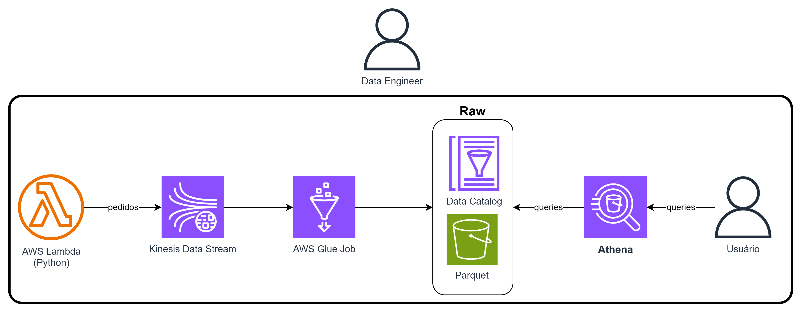

# Bootcamp Advanced Data Engineering
Author: Prof. Barbosa<br>
Contact: infobarbosa@gmail.com<br>
Github: [infobarbosa](https://github.com/infobarbosa)

# 30 - Kinesis

O objetivo desta sessão é executar operações de extração, transformação e carga (ETL) utilizando o Glue Job utilizando o Kinesis Data Streams como fonte de dados.



# **Parte 1** - Preparação da stream AWS Kinesis
1. Criando a stream `pedidos`

Vamos criar um data stream do Kinesis que será a fonte de dados de streaming para o nosso Glue job.

```
aws kinesis create-stream --stream-name pedidos --shard-count 1
```
2. Verificando se a stream foi criada corretamente
```
aws kinesis list-streams
```

Output esperado:
```
voclabs:~/environment/bootcamp-advanced-data-engineering (main) $ aws kinesis list-streams
{
    "StreamNames": [
        "pedidos"
    ],
    "StreamSummaries": [
        {
            "StreamName": "pedidos",
            "StreamARN": "arn:aws:kinesis:us-east-1:905418220738:stream/pedidos",
            "StreamStatus": "ACTIVE",
            "StreamModeDetails": {
                "StreamMode": "PROVISIONED"
            },
            "StreamCreationTimestamp": "2024-02-14T15:05:37+00:00"
        }
    ]
}
```

Se tudo deu certo então você verá uma stream `pedidos` com seus metadados.

# **Parte 2** - Preparação variáveis de ambiente

3. Exportanto a variável de ambiente `BUCKET_NAME`
```
export BUCKET_NAME=$(aws s3api list-buckets --query "Buckets[].Name" | grep 'lab-data-eng' | tr -d ' ' | tr -d '"' | tr -d ',')
```

4. Verificando o conteúdo da variável `BUCKET_NAME`
```
echo $BUCKET_NAME
```

Output esperado:
```
voclabs:~/environment/bootcamp-advanced-data-engineering (main) $ echo $BUCKET_NAME
lab-data-eng-20240213-905418220738-user3047456
```

5. Exportando a variável de ambiente `LAB_ROLE_ARN`
```
export LAB_ROLE_ARN=$(aws iam get-role --role-name LabRole | jq '.Role.Arn' -r)
```

6. Verificando o conteúdo da variável `LAB_ROLE_ARN`
```
echo $LAB_ROLE_ARN
```

7. Exportanto a variável de ambiente `STREAM_ARN`
```
export STREAM_ARN=$(aws kinesis list-streams | jq '.StreamSummaries[].StreamARN' | tr -d '"' | grep -i pedidos)
```

8. Verificando o conteúdo da variável `STREAM_ARN`
```
echo $STREAM_ARN
```

Output esperado:
```
voclabs:~/environment/bootcamp-advanced-data-engineering (main) $ echo $STREAM_ARN
arn:aws:kinesis:us-east-1:905418220738:stream/pedidos
```

# **Parte 3** - Preparação do job AWS Glue

Examine com atenção o conteúdo do script `glue-job-pedidos-stream.py` que está no diretório `30-Kinesis/assets/scripts/`.

9. Upload do script para o S3
```
aws s3 cp 30-Kinesis/assets/scripts/glue-job-pedidos-stream.py s3://${BUCKET_NAME}/scripts/glue-job-pedidos-stream.py
```

10. Verificando se o upload ocorreu com sucesso:
```
aws s3 ls s3://${BUCKET_NAME}/scripts/glue-job-pedidos-stream.py
```

Output esperado:
```
voclabs:~/environment/bootcamp-advanced-data-engineering (main) $ aws s3 ls s3://${BUCKET_NAME}/scripts/glue-job-pedidos-stream.py
2024-02-17 21:25:41       2508 glue-job-pedidos-stream.py
```

11. Criando as pastas no S3
```
aws s3api put-object --bucket ${BUCKET_NAME} --key temp/
```

```
aws s3api put-object --bucket ${BUCKET_NAME} --key spark-ui/
```

12. Criando o job

Examine com atenção os parâmetos utilizados no comando a seguir.
```
aws glue create-job \
    --name glue-job-pedidos-stream \
    --role LabRole \
    --timeout 15 \
    --command Name=gluestreaming,ScriptLocation=s3://${BUCKET_NAME}/scripts/glue-job-pedidos-stream.py \
    --default-arguments '{"--BUCKET_NAME":"'${BUCKET_NAME}'","--STREAM_ARN":"'${STREAM_ARN}'","--TempDir":"s3://'"${BUCKET_NAME}"'/temp","--enable-spark-ui":"true","--spark-event-logs-path":"s3://'"${BUCKET_NAME}"'/spark-ui/","--enable-metrics":"true","--enable-job-insights":"true","--enable-continuous-cloudwatch-log":"true","--job-language":"python"}' \
    --cli-input-json "file://30-Kinesis/assets/scripts/glue-job-pedidos-stream.json" 
```

Perceba o parâmetro `--timeout`. O valor padrão é de 2880 minutos (48 horas!).<br> 
Por se tratar de um job de captura de streaming em ambiente de laboratório, estamos ajustando para 15 minutos. 


13. Executando o job
```
aws glue start-job-run --job-name glue-job-pedidos-stream
```

Parabéns! Neste ponto você tem uma stream pronta para receber dados e um job glue conectado à mesma.


# **Parte 4** - Preparação da função AWS Lambda

14. Criando a função Lambda com o  `gerador-pedidos`:
```
aws lambda create-function \
    --function-name gerador-pedidos \
    --zip-file fileb://./30-Kinesis/assets/lambda/function.zip \
    --handler lambda_function.lambda_handler \
    --runtime python3.12 \
    --role $LAB_ROLE_ARN \
    --timeout 900
```

Output esperado:
```
voclabs:~/environment/bootcamp-advanced-data-engineering (main) $ aws lambda create-function \
>     --function-name gerador-pedidos \
>     --zip-file fileb://./30-Kinesis/assets/lambda/function.zip \
>     --handler lambda_function.lambda_handler \
>     --runtime python3.12 \
>     --role $LAB_ROLE_ARN \
>     --timeout 900
{
    "FunctionName": "gerador-pedidos",
    "FunctionArn": "arn:aws:lambda:us-east-1:905418220738:function:gerador-pedidos",
    "Runtime": "python3.12",
    "Role": "arn:aws:iam::905418220738:role/LabRole",
    "Handler": "lambda_function.lambda_handler",
    "CodeSize": 35978375,
    "Description": "",
    "Timeout": 900,
    "MemorySize": 128,
    "LastModified": "2024-02-18T15:58:53.781+0000",
    "CodeSha256": "i1fvxjdj2shjojE/wtuqxn1QCQXUarklSztXagNGhVk=",
    "Version": "$LATEST",
    "TracingConfig": {
        "Mode": "PassThrough"
    },
    "RevisionId": "b26ea5da-f129-4cb6-a11e-81b76a6688a7",
    "State": "Pending",
    "StateReason": "The function is being created.",
    "StateReasonCode": "Creating",
    "PackageType": "Zip",
    "Architectures": [
        "x86_64"
    ],
    "EphemeralStorage": {
        "Size": 512
    },
    "SnapStart": {
        "ApplyOn": "None",
        "OptimizationStatus": "Off"
    },
    "RuntimeVersionConfig": {
        "RuntimeVersionArn": "arn:aws:lambda:us-east-1::runtime:776a3759221679a634181f858871d5514dc74a176f78bc535f822a932845ae5a"
    },
    "LoggingConfig": {
        "LogFormat": "Text",
        "LogGroup": "/aws/lambda/gerador-pedidos"
    }
}
```


> Atenção!<br>
> Se você já tem uma função Lambda e quer atualizá-la com um novo código, use o comando aws lambda update-function-code:
>```
>aws lambda update-function-code --function-name gerador-pedidos --zip-file fileb://../lambda/function.zip
>```

Agora, sua função Lambda está pronta para ser usada na AWS.

15. Invocando a função lambda
```
aws lambda invoke --function-name gerador-pedidos out.json
```

# **Parte 5** - Verificando a ingestão

