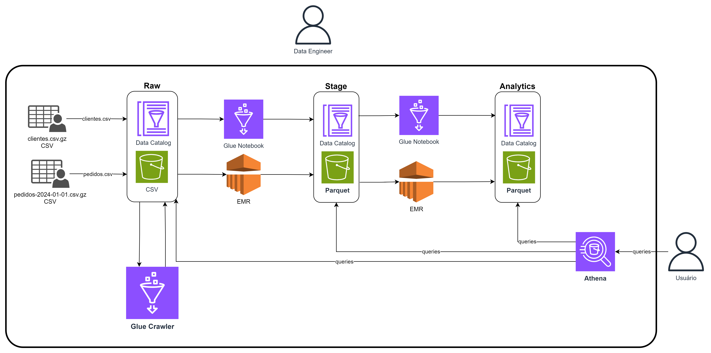

# Bootcamp Advanced Data Engineering

Author: Prof. Barbosa 
Contact: infobarbosa@gmail.com 
Github: [infobarbosa](https://github.com/infobarbosa)

O objetivo desse laboratório é promover a prática de pipelines de dados na AWS. 
Ao final a pessoa deverá ter familiaridade o suficiente para expandir seus estudos nos principais serviços oferecidos pela plataforma.

## Alerta Importante! Gerenciamento de Custos na AWS

Este laboratório é baseado na Amazon Web Services (AWS), uma plataforma que cobra com base no uso dos recursos. É crucial que você esteja ciente de que os serviços utilizados neste laboratório podem gerar custos.

Para evitar cobranças inesperadas:

1. **Desligue ou libere os recursos quando não estiverem em uso**: A AWS cobra por muitos de seus serviços pelo tempo que eles estão rodando, mesmo que não estejam sendo ativamente usados. Se você não estiver usando um serviço, desligue-o ou libere-o para evitar custos desnecessários.

2. **Monitore o uso e os custos**: A AWS fornece ferramentas como o AWS Budgets e o AWS Cost Explorer que você pode usar para acompanhar o uso e os custos dos serviços da AWS.

3. **Limpe após a conclusão do laboratório**: Quando você terminar o laboratório, certifique-se de excluir todos os recursos que você criou. Isso inclui instâncias EC2, buckets S3, tabelas DynamoDB e outros recursos da AWS.

Lembre-se, você é responsável por todos os custos associados ao uso da AWS para este laboratório. Por favor, gerencie seus recursos com cuidado para evitar cobranças inesperadas.